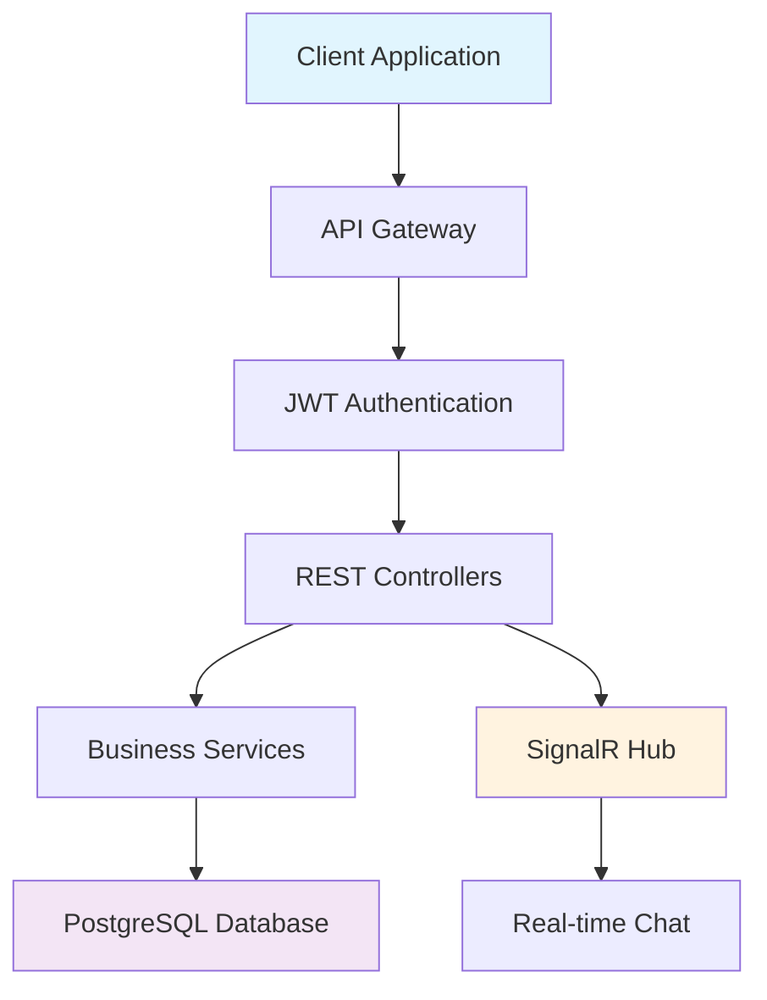

<div align="center">

# 🚀 Realtime Chat API

### *Enterprise-grade Real-time Communication System with .NET 8 & SignalR*

[](https://dotnet.microsoft.com/)
[](https://dotnet.microsoft.com/apps/aspnet/signalr)
[](https://www.postgresql.org/)
[](https://jwt.io/)
[](./LICENSE)


*A robust, scalable, and production-ready chat API built with modern .NET technologies*

[🎯 Features](#-features) • [📖 Documentation](#-api-documentation) • [🚀 Quick Start](#-quick-start) • [🛠️ Tech Stack](#️-tech-stack) • [🤝 Contributing](#-contributing)

</div>

---

## 🌟 Features

<table>
<tr>
<td width="50%">

### 🔥 **Real-time Communication**
- 💬 **Instant messaging** with SignalR WebSockets
- 👥 **Public and private chat rooms**
- 🟢 **Online/offline user status**
- 📱 **Real-time notifications**
- ⚡ **Low-latency message delivery**

</td>
<td width="50%">

### 🛡️ **Security & Architecture**
- 🔐 **JWT Authentication & Authorization**
- 🏗️ **Clean Architecture implementation**
- 📊 **Rate limiting & spam protection**
- 🔒 **Secure password hashing**
- 🚀 **Optimized database queries**

</td>
</tr>
</table>

---

## 🏗️ System Architecture



<div align="center">

### 📁 **Project Structure**

</div>

```
📦 RealtimeChat/
├── 🌐 API/                 # Controllers, Hubs & Presentation Layer
├── ⚙️ Application/         # Business Logic & Services
├── 🏗️ Infrastructure/      # Data Access & External Services
├── 🎯 Domain/              # Core Entities & Business Rules
└── 📋 Shared/              # DTOs & Common Models
```

---

## 🚀 Quick Start

<div align="center">

### 📋 **Prerequisites**


</div>

### 1️⃣ **Clone the Repository**

```bash
git clone https://github.com/piodois/realtime-chat-api.git
cd realtime-chat-api
```

### 2️⃣ **Database Setup**

```sql
-- PostgreSQL Database Setup
CREATE DATABASE RealtimeChatDb;
CREATE USER chatuser WITH PASSWORD 'your_secure_password';
GRANT ALL PRIVILEGES ON DATABASE RealtimeChatDb TO chatuser;
```

### 3️⃣ **Configuration**

Create `appsettings.Development.json` from the example file:

```json
{
  "ConnectionStrings": {
    "DefaultConnection": "Host=localhost;Database=RealtimeChatDb;Username=chatuser;Password=your_secure_password;Port=5432"
  },
  "Jwt": {
    "Key": "your-super-secret-jwt-key-must-be-at-least-32-characters-long",
    "Issuer": "RealtimeChat",
    "Audience": "RealtimeChatUsers"
  }
}
```

### 4️⃣ **Run the Application**

```bash
# Restore dependencies
dotnet restore

# Build the project
dotnet build

# Run the API
dotnet run --project src/RealtimeChat.API
```

<div align="center">

### 🎉 **Ready!** 

**API Base URL:** `http://localhost:5000/api`  
**Swagger Documentation:** `http://localhost:5000/swagger`  
**SignalR Hub:** `ws://localhost:5000/chatHub`

</div>

---

## 📖 API Documentation

### 🔐 **Authentication Endpoints**

<details>
<summary><b>👤 User Registration</b></summary>

```http
POST /api/auth/register
Content-Type: application/json

{
  "username": "johndoe",
  "email": "john@example.com",
  "password": "SecurePassword123!"
}
```

**Response:**
```json
{
  "token": "eyJhbGciOiJIUzI1NiIsInR5cCI6IkpXVCJ9...",
  "user": {
    "id": "550e8400-e29b-41d4-a716-446655440000",
    "username": "johndoe",
    "email": "john@example.com",
    "isOnline": true,
    "lastSeen": "2025-01-20T10:30:00Z"
  }
}
```
</details>

<details>
<summary><b>🔑 User Login</b></summary>

```http
POST /api/auth/login
Content-Type: application/json

{
  "email": "john@example.com",
  "password": "SecurePassword123!"
}
```
</details>

### 💬 **Chat Endpoints**

<details>
<summary><b>🏠 Chat Room Management</b></summary>

```http
# Get user's chat rooms
GET /api/chat/rooms
Authorization: Bearer {jwt_token}

# Create new chat room
POST /api/chat/rooms
Authorization: Bearer {jwt_token}
Content-Type: application/json

{
  "name": "General Discussion",
  "description": "A place for general conversations",
  "isPrivate": false
}

# Join a chat room
POST /api/chat/rooms/{roomId}/join
Authorization: Bearer {jwt_token}

# Get room messages
GET /api/chat/rooms/{roomId}/messages?page=1&pageSize=50
Authorization: Bearer {jwt_token}
```
</details>

### ⚡ **Real-time Communication**

<details>
<summary><b>🔌 SignalR WebSocket Connection</b></summary>

```javascript
// Connect to SignalR Hub
const connection = new signalR.HubConnectionBuilder()
    .withUrl("/chatHub", {
        accessTokenFactory: () => localStorage.getItem("jwt_token")
    })
    .build();

// Start connection
await connection.start();
console.log("Connected to chat hub!");

// Listen for incoming messages
connection.on("ReceiveMessage", (message) => {
    console.log("New message received:", message);
    // Update your UI here
});

// Listen for user status changes
connection.on("UserConnected", (userId) => {
    console.log(`User ${userId} came online`);
});

connection.on("UserDisconnected", (userId) => {
    console.log(`User ${userId} went offline`);
});
```
</details>

<details>
<summary><b>📤 Sending Messages</b></summary>

```javascript
// Send a message to a chat room
await connection.invoke("SendMessage", {
    content: "Hello everyone! 👋",
    chatRoomId: "550e8400-e29b-41d4-a716-446655440000"
});

// Join a chat room (to receive messages)
await connection.invoke("JoinRoom", "550e8400-e29b-41d4-a716-446655440000");

// Leave a chat room
await connection.invoke("LeaveRoom", "550e8400-e29b-41d4-a716-446655440000");
```
</details>

---

## 🛠️ Tech Stack

<div align="center">

| Category | Technology | Version | Purpose |
|----------|------------|---------|---------|
| 🎯 **Framework** | ASP.NET Core | 8.0 | Web API Framework |
| ⚡ **Real-time** | SignalR | 8.0 | WebSocket Communication |
| 🔐 **Authentication** | JWT Bearer | 8.0 | Secure Authentication |
| 🗄️ **Database** | PostgreSQL | 13+ | Primary Database |
| 🔄 **ORM** | Entity Framework Core | 8.0 | Object-Relational Mapping |
| 🗺️ **Mapping** | AutoMapper | 12.0 | Object-to-Object Mapping |
| 📚 **Documentation** | Swagger/OpenAPI | 6.5 | API Documentation |
| 🐳 **Containerization** | Docker | Latest | Application Containerization |

</div>

### 🏗️ **Architecture Patterns**

- ✅ **Clean Architecture** - Separation of concerns and dependency inversion
- ✅ **Repository Pattern** - Data access abstraction
- ✅ **CQRS** - Command Query Responsibility Segregation
- ✅ **Dependency Injection** - Loose coupling and testability
- ✅ **JWT Authentication** - Stateless authentication

---

## 🚀 Development

### 🔧 **Development Commands**

```bash
# Run with hot reload
dotnet watch run --project src/RealtimeChat.API

# Create database migration
dotnet ef migrations add MigrationName --project src/RealtimeChat.Infrastructure --startup-project src/RealtimeChat.API

# Apply database migrations
dotnet ef database update --project src/RealtimeChat.Infrastructure --startup-project src/RealtimeChat.API

# Run tests
dotnet test

# Build for production
dotnet publish -c Release
```

### 🐳 **Docker Support**

```bash
# Run with Docker Compose (includes PostgreSQL)
docker-compose up -d

# Run only PostgreSQL
docker-compose up postgres -d

# Build API Docker image
docker build -t realtime-chat-api .
```

### 🧪 **Testing**

```bash
# Run all tests
dotnet test

# Run tests with coverage
dotnet test --collect:"XPlat Code Coverage"

# Run specific test project
dotnet test tests/RealtimeChat.UnitTests/
```

---

## 📊 API Endpoints Overview

| Method | Endpoint | Description | Auth Required |
|--------|----------|-------------|---------------|
| `POST` | `/api/auth/register` | Register new user | ❌ |
| `POST` | `/api/auth/login` | Authenticate user | ❌ |
| `GET` | `/api/health` | Health check | ❌ |
| `GET` | `/api/chat/rooms` | Get user's chat rooms | ✅ |
| `POST` | `/api/chat/rooms` | Create new chat room | ✅ |
| `POST` | `/api/chat/rooms/{id}/join` | Join chat room | ✅ |
| `GET` | `/api/chat/rooms/{id}/messages` | Get room messages | ✅ |

### 🔌 **SignalR Hub Methods**

| Method | Description | Parameters |
|--------|-------------|------------|
| `JoinRoom` | Join a chat room | `roomId: string` |
| `LeaveRoom` | Leave a chat room | `roomId: string` |
| `SendMessage` | Send message to room | `{content: string, chatRoomId: string}` |

### 📡 **SignalR Events**

| Event | Description | Data |
|-------|-------------|------|
| `ReceiveMessage` | New message received | `MessageDto` |
| `UserConnected` | User came online | `userId: string` |
| `UserDisconnected` | User went offline | `userId: string` |

---

## ⚙️ Configuration

### 🔧 **Environment Variables**

| Variable | Description | Example |
|----------|-------------|---------|
| `ConnectionStrings:DefaultConnection` | PostgreSQL connection string | `Host=localhost;Database=RealtimeChatDb;Username=chatuser;Password=***` |
| `Jwt:Key` | JWT signing key (min 32 chars) | `your-super-secret-jwt-key-here` |
| `Jwt:Issuer` | JWT token issuer | `RealtimeChat` |
| `Jwt:Audience` | JWT token audience | `RealtimeChatUsers` |

### 📝 **Configuration Files**

- `appsettings.json` - Production configuration
- `appsettings.Development.json` - Development configuration
- `appsettings.Development.example.json` - Template for development settings

---

## 🔒 Security Features

- 🔐 **JWT Authentication** - Secure token-based authentication
- 🔒 **Password Hashing** - SHA-256 password encryption
- 🛡️ **Authorization Policies** - Role-based access control
- 📊 **Rate Limiting** - Protection against spam and abuse
- 🔍 **Input Validation** - Data validation and sanitization
- 🚫 **CORS Configuration** - Cross-origin request security

---

## 🚀 Deployment

### 🌐 **Production Deployment**

1. **Configure Production Settings**
   ```json
   {
     "ConnectionStrings": {
       "DefaultConnection": "production-database-connection-string"
     },
     "Jwt": {
       "Key": "production-jwt-secret-key"
     }
   }
   ```

2. **Build for Production**
   ```bash
   dotnet publish -c Release -o ./publish
   ```

3. **Run with Production Profile**
   ```bash
   ASPNETCORE_ENVIRONMENT=Production dotnet RealtimeChat.API.dll
   ```

### ☁️ **Cloud Deployment Options**

- **Azure App Service** - Recommended for .NET applications
- **AWS Elastic Beanstalk** - Easy deployment with auto-scaling
- **Google Cloud Run** - Serverless container deployment
- **Heroku** - Simple deployment with PostgreSQL add-on

---

## 🤝 Contributing

We welcome contributions! Please follow these guidelines:

### 📋 **How to Contribute**

1. 🍴 **Fork** the repository
2. 🌟 **Create** a feature branch (`git checkout -b feature/amazing-feature`)
3. 💾 **Commit** your changes (`git commit -m 'Add: Amazing feature'`)
4. 📤 **Push** to the branch (`git push origin feature/amazing-feature`)
5. 🔄 **Open** a Pull Request

### 📝 **Contribution Guidelines**

- Follow **conventional commit** format
- Include **unit tests** for new features
- Update **documentation** as needed
- Ensure **code quality** standards
- Test across different **environments**

### 🐛 **Bug Reports**

Please use the [GitHub issue tracker](https://github.com/piodois/realtime-chat-api/issues) to report bugs.

---

## 📄 License

This project is licensed under the **MIT License** - see the [LICENSE](LICENSE) file for details.

---

## 👨‍💻 Author

**Pio Cerda**  
Full Stack Developer | .NET Specialist

[](https://github.com/piodois)
[](https://www.linkedin.com/in/piocerda/)

---

## 🙏 Acknowledgments

- [Microsoft Documentation](https://docs.microsoft.com/aspnet/core/) - Official ASP.NET Core documentation
- [SignalR Documentation](https://docs.microsoft.com/aspnet/core/signalr/) - Real-time web functionality guide
- [Entity Framework Core](https://docs.microsoft.com/ef/core/) - Modern object-database mapper
- [Clean Architecture](https://blog.cleancoder.com/uncle-bob/2012/08/13/the-clean-architecture.html) - Architecture principles

---

<div align="center">

### ⭐ **Star this repository if you found it helpful!**


**Follow for more awesome projects!** 🚀

</div>
